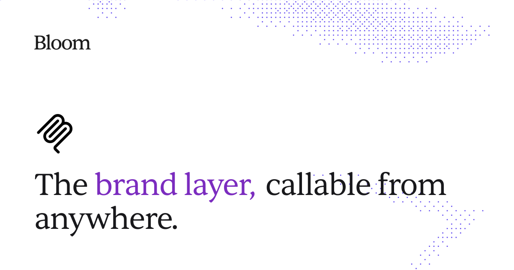

# Bloom Agent Skills

Agent skill for using Bloom's MCP.

Bloom is brand-aware: brand visual DNA, palette, typography, and aesthetic direction are already handled by the Bloom MCP server. This skill teaches agents how to write useful prompts, choose aspect ratios, attach references, and write in-image headline copy.

## Quickstart

1. Connect the Bloom MCP server in your agent:

   ```text
   https://trybloom.ai/mcp
   ```

2. Install the Bloom skill:

   ```bash
   npx skills add TomasWard1/bloom-skills --skill bloom --global
   ```

3. Ask your agent to create with Bloom:

   ```text
   Generate an Instagram feed launch image for Acme with Bloom. The product box floating above a messy breakfast table, morning light, one hand reaching into frame. Photograph.
   ```

For agent-specific installs, Claude web/cloud setup, updates, and troubleshooting, see [docs/quickstart.md](docs/quickstart.md).

## Claude Code, Codex, Cursor, And Local Agents

If your agent can run terminal commands in your project, give it this:

```text
Install the Bloom skill by running:
npx skills add TomasWard1/bloom-skills --skill bloom --global

Then connect Bloom MCP from:
https://trybloom.ai/mcp

After that, use Bloom whenever I ask for image generation.
```

Use this flow for Claude Code, Codex, Cursor, OpenCode, Windsurf, and other local coding agents that support Agent Skills through `npx skills`.

## Claude Desktop, Claude Web, And Cowork

These clients need a manual skill upload. Do not give them the `npx skills add` command and expect it to install locally.

1. Download [`bloom.skill.zip`](https://github.com/TomasWard1/bloom-skills/raw/main/dist/bloom.skill.zip).
2. Upload that ZIP in Claude's Skills settings.
3. Connect Bloom MCP from:

   ```text
   https://trybloom.ai/mcp
   ```

The ZIP root contains `SKILL.md` and `rules/`, which is the structure Claude expects.

## Install

Recommended: install the Bloom skill globally so it is available across projects:

```bash
npx skills add TomasWard1/bloom-skills --skill bloom --global
```

To install only in the current project:

```bash
npx skills add TomasWard1/bloom-skills --skill bloom
```

For local testing from this repository:

```bash
npx skills add . --skill bloom
```

## What This Includes

```text
skills/bloom/
  SKILL.md
  rules/
    prompting.md
    copy.md
    workflow.md
    channels.md
```

`SKILL.md` is the dispatcher. The files in `rules/` are task-specific guidance the agent reads only when needed.

## Requirements

This skill assumes the Bloom MCP server is already connected in your agent. The skill does not install or authenticate the MCP server by itself.

Bloom MCP setup docs:

```text
https://trybloom.ai/mcp
```

## License

MIT
